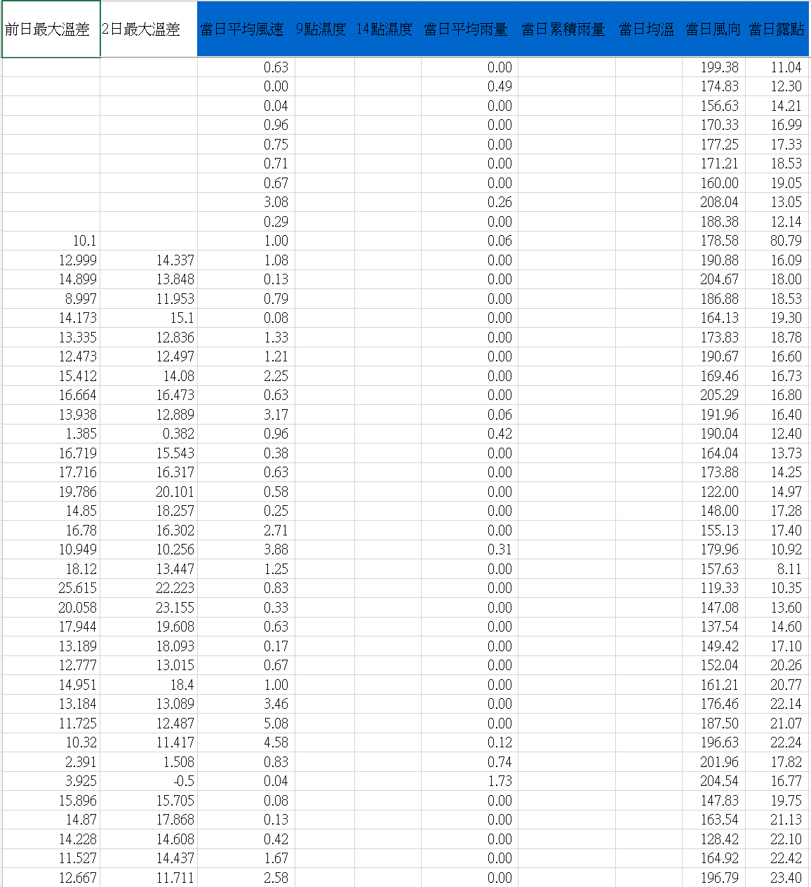

# RiceBlastDiseaseClassification

基於人工智慧預測稻熱病惡化程度分類模型

## Project Description

利用稻田中sensor獲得的資料，對稻米的稻熱病惡化程度作預測

將溫度、濕度等等資料當作feature做訓練成分類模型

訓練好的模型可對當前的數值做預測

經訓練後實測，準確率可達75%

## Data

由農委會提供的103年至110年各區農田資料

內包含微氣候資料、大氣氣候資料及稻熱病發病率資料

 ## Data Preprcessing

 為求準確我們先只使用雲嘉南地區的資料，地理位置氣候較接近

 並排除缺失資料

.

.

.

.

.

.

.

.

.

.

.

.

## *修改* 

### 資料前處理改成python

### *待補*